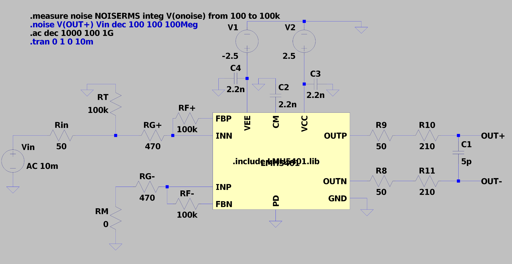

# LMH5401 Differential Amplifier (AGH Project)

High-speed differential amplifier designed using **LMH5401** for RF / ADC front-end applications.

---

## Overview

This project presents the design, simulation, implementation, and measurement of a **low-noise fully differential amplifier** intended for high-frequency signal processing.

The circuit is based on the **LMH5401**, a wideband amplifier capable of operating up to GHz frequencies, commonly used in communication, radar, and data acquisition systems.

---

## Objectives

- Design a high-speed differential amplifier
- Achieve high gain (~40 dB target)
- Maintain wide bandwidth
- Ensure proper impedance matching (RF domain)
- Validate performance through simulations and measurements

---

## Simulation (LTspice)



LTspice simulation (version 26) was used to:

- select feedback resistor values 
- verify circuit stability 
- estimate gain and frequency response 
- evaluate output noise performance 

LTspice was downloaded from:
https://www.analog.com/en/resources/design-tools-and-calculators/ltspice-simulator.html 

Download links were available as of 01.04.2026.
---

### LTspice Setup

Simulation files are located in:

```
LTspice/
```

Contents:

- `lmh5401_test.asc` – main simulation schematic
- `LMH5401.lib` – SPICE model
- `LMH5401.asy` – LTspice symbol

---

### SPICE Model (Download)

The LMH5401 SPICE model and symbol used in this project are based on files provided by **Texas Instruments**.

Official product page:
https://www.ti.com/product/LMH5401

Direct download (SPICE model):
https://www.ti.com/lit/zip/sbombp6

The download link was verified as accessible on **30.03.2026**.

---

### Simulation Directives

```spice
.ac dec 1000 100 1G
.tran 0 1 0 10m
.noise V(OUT+) Vin dec 100 100 100Meg
.measure noise NOISERMS integ V(onoise) from 100 to 100k
```

---

## Design

### Schematic (KiCad)


### 3D View


### PCB Layout


---

## Equipment

* Rigol DSA815 – Spectrum Analyzer
* Rigol MSO5204 – Oscilloscope
* Siglent SDG2122X – Signal Generator

---

## Experimental Results

### Signal Generator Setup


- Frequency: **1 MHz**
- Amplitude: **10 mVpp**
- Differential signal (180° phase shift)

---

### Oscilloscope Output


- Measured gain: **~68× (~36.6 dB)**
- Proper differential operation
- 180° phase shift between outputs

---

## Results

- Measured gain: **~36.65 dB**
- Target gain: **~40 dB**
- Effective bandwidth: **~3.7 MHz**

This is significantly lower than the expected GHz-range bandwidth of the LMH5401, indicating strong influence of:

- PCB parasitics
- impedance mismatch
- non-RF layout constraints

---

## Key Findings

- The amplifier operates correctly in differential mode
- Gain is close to expected values
- Bandwidth is significantly reduced compared to theoretical assumptions

---

## Improvements

- Improve RF impedance matching (50 Ω design)
- Optimize PCB layout (shorter traces, controlled impedance)
- Use high-frequency optimized passive components
- Perform S-parameter simulations
- Reduce parasitic capacitances

---

## Project Structure

```
├── bom/
│   └── ibom.html
├── images/
├── LTspice/
│   ├── LMH5401.asy
│   ├── LMH5401.lib
│   └── lmh5401_test.asc
├── manufacturing/
│   └── Gerber.zip
├── Projekt_AUE.csv
├── Projekt_AUE.kicad_pcb
├── Projekt_AUE.kicad_pro
├── Projekt_AUE.kicad_sch
└── README.md
```

---

## Authors

- Hubert Jabłoński
- Jakub Domin
- Wojciech Broda

