# ⚡ LMH5401 Differential Amplifier (AGH Project)

High-speed differential amplifier designed using **LMH5401** for RF / ADC front-end applications.

📄 Full report:
👉 [Project Report (PDF)](./Analogowe_układy_peryferyjne_w_systemach_cyfrowych.pdf)

---

## 📌 Overview

This project presents the design, simulation, implementation, and measurement of a **low-noise fully differential amplifier** intended for high-frequency signal processing.

The circuit is based on the **LMH5401**, a wideband amplifier capable of operating up to GHz frequencies, commonly used in communication, radar, and data acquisition systems.

---

## 🎯 Objectives

* Design a high-speed differential amplifier
* Achieve high gain (~40 dB target)
* Maintain wide bandwidth
* Ensure proper impedance matching (RF domain)
* Validate performance through measurements

---

## 🛠 Design

### 🔌 Schematic (KiCad)

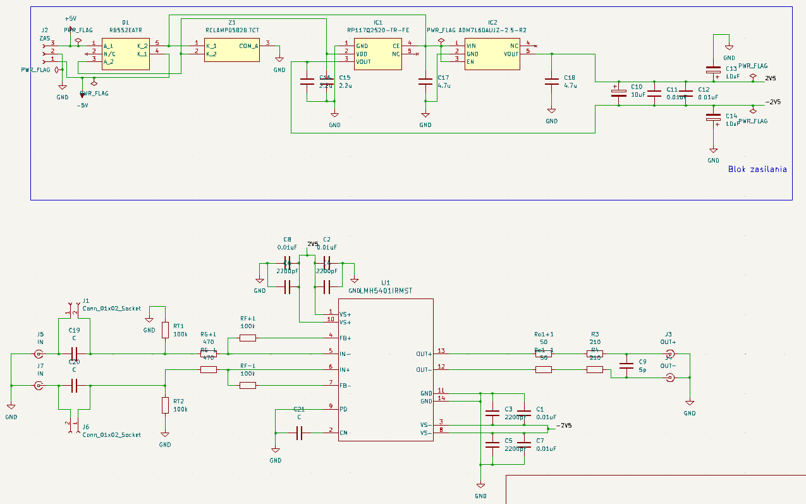

### 🧩 PCB Layout

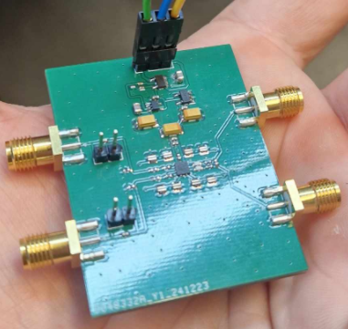

### 🧱 3D View

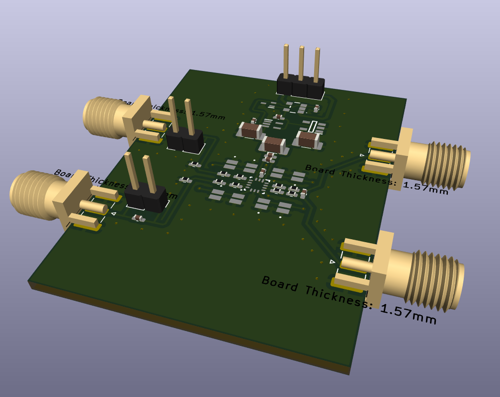

---

## 🔬 Simulation (LTspice)

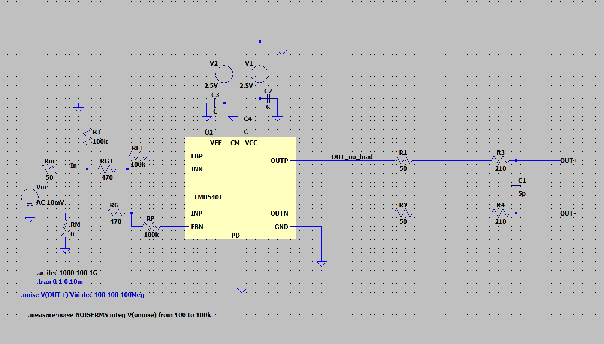

Simulation was used to:

* select feedback resistor values
* verify stability
* estimate gain and frequency response

---

## 📈 Measurements

### 🎛 Signal Generator Setup

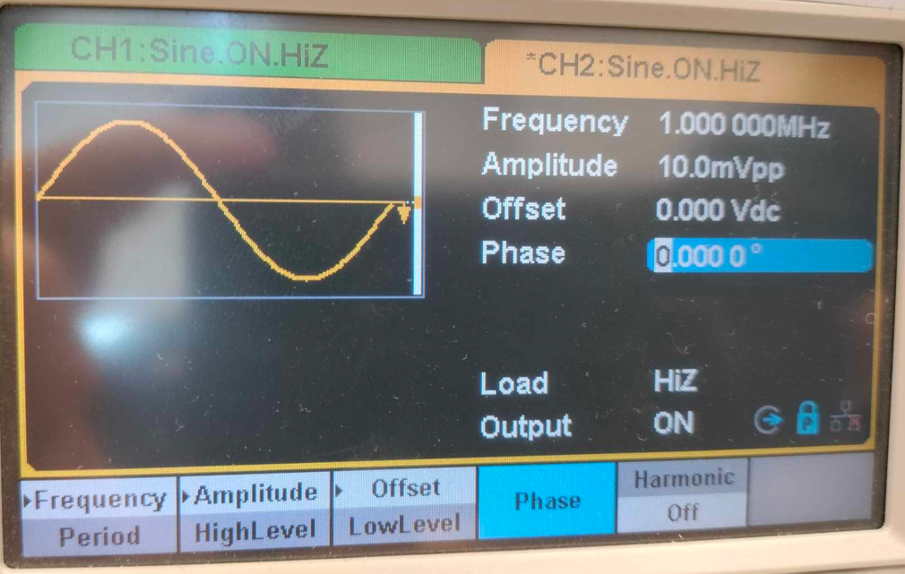

* Frequency: **1 MHz**
* Amplitude: **10 mVpp**
* Differential signal (180° phase shift)

---

### 📺 Oscilloscope Output

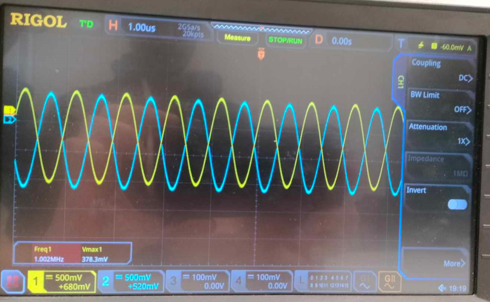

* Measured gain: **~68× (~36.6 dB)**
* Proper differential operation
* 180° phase shift between signals

---

### 📉 Frequency Response

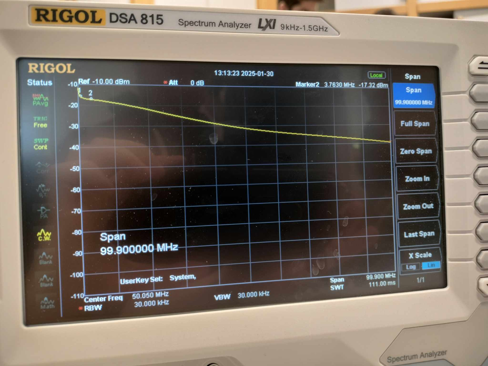

---

## 📡 Spectrum Analysis

### 📊 Amplified Signal

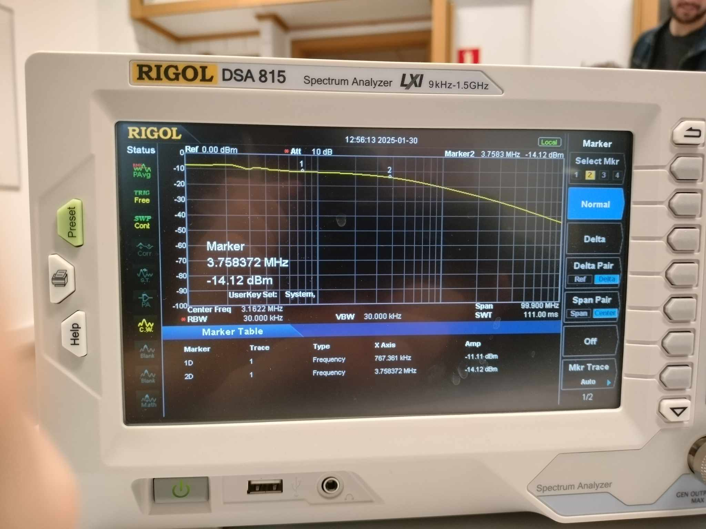

* Example: **3.76 MHz → -14 dBm**
* Noticeable attenuation at higher frequencies

---

### 📉 Bandwidth Limitation

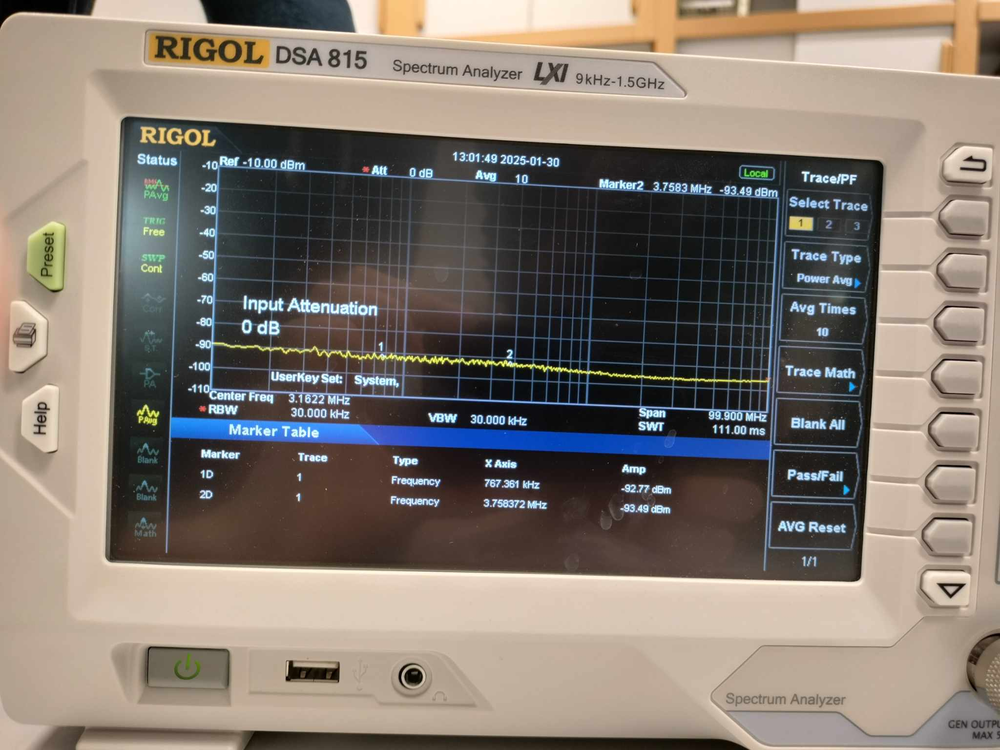

* Signal amplitude decreases with frequency
* Indicates limited bandwidth

---

### 🔇 Noise (Input)

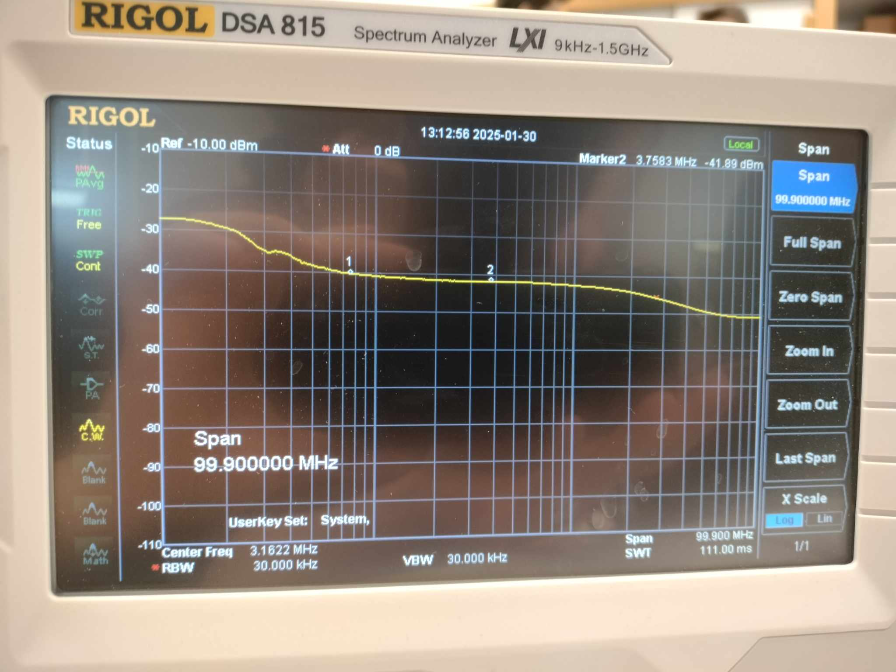

### 🔊 Noise (Output)

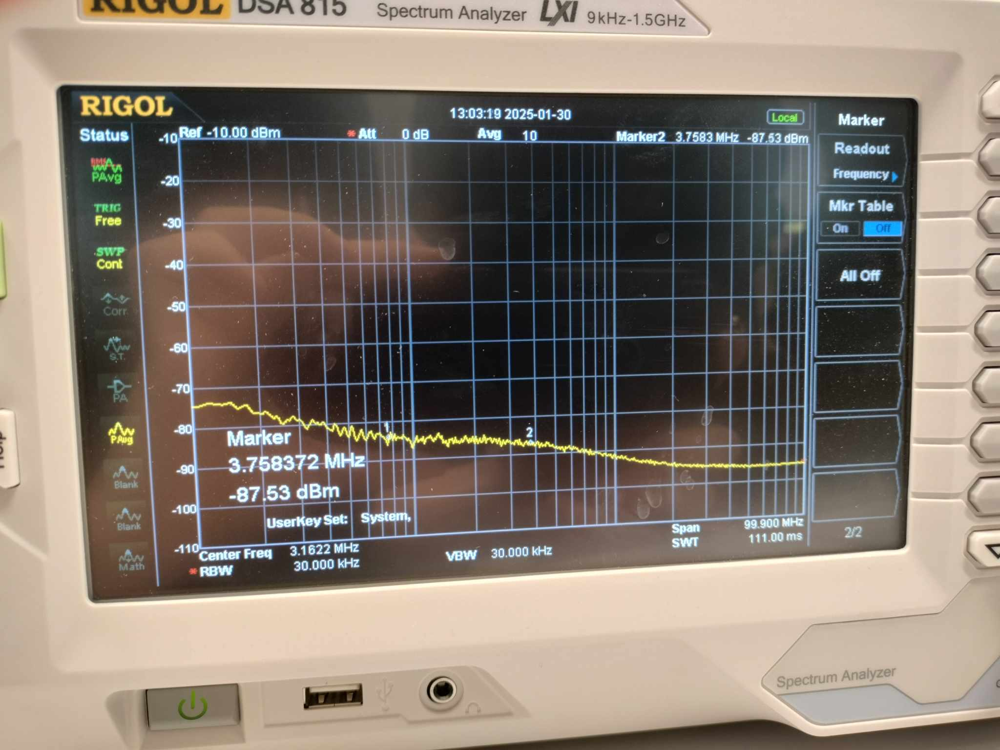

---

## 📊 Results

* Measured gain: **~36.65 dB**
* Target gain: **~40 dB**
* Effective bandwidth: **~3.7 MHz** (significantly lower than expected)

According to the project report:


* Early signal attenuation (~3.7 MHz) was observed
* Performance degradation likely caused by:

  * impedance mismatch
  * parasitic effects
  * PCB layout limitations

---

## ⚠️ Key Findings

* The amplifier operates correctly in differential mode
* Gain is close to expected values
* Bandwidth is significantly reduced compared to theoretical assumptions

---

## 🚀 Improvements

* Improve RF impedance matching (50 Ω design)
* Optimize PCB layout (shorter traces, controlled impedance)
* Use high-frequency optimized passive components
* Perform S-parameter simulations
* Reduce parasitic capacitances

---

## 📁 Project Structure

```
├── bom/
├── images/
├── manufacturing/
├── Projekt_AUE.kicad_pcb
├── Projekt_AUE.kicad_sch
├── README.md
```

---

## 🧪 Equipment

* Rigol DSA815 – Spectrum Analyzer
* Rigol MSO5204 – Oscilloscope
* Siglent SDG2122X – Signal Generator

---

## 👨‍💻 Authors

**Project Team:**

- Hubert Jabłoński <br> 
- Jakub Domin <br>
- Wojciech Broda <br>

AGH University of Science and Technology
